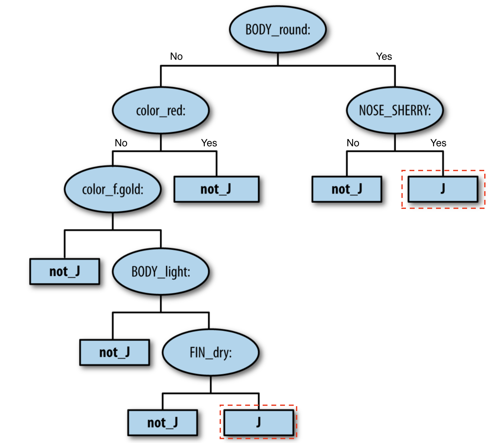

# K-means Clustering

## Intuition
Given a _number of clusters_, an _initialization point_ for each cluster centroid and a preferred _definition of distance_:
1. Assign each observation to the closest cluster by calculating the distance to the centroid 
using the given _definition of distance_.
2. Recalculate the centroid of each cluster averaging all the observations that belong to the cluster.
3. Repeat 1.  
   - If there are no re-assignments: stop.
   - If there are re-assignments: go to step 2.
 
 A gif is worth a million words:
 

K-means is considered relatively fast as its main operation is only computing distances between each point an the centroids.

### Hyper-parameters
1. Number of clusters.
2. Definition of distance: Manhattan, Euclidean, Minkowski, among many others.

### Pitfall: The Random Initialization Trap

In a _vanilla_ implementation of the k-means algorithm, __the result of the algorithm is dependent on the
initialization points for the centroids__. The following picture shows why:


#### How to combat this?
There is a variation of the algorithm called the [k-means++ algorithm](https://en.wikipedia.org/wiki/K-means%2B%2B)
which fixes this problem.

The course did not explain how it works. But, the good news is that most of the tools already implement this
variant so __we just need to make sure that we are using uses the _kmeans++_ variant__.  For example:
- R includes k-means, and the "flexclust" package can do k-means++
- Scikit-learn has a K-Means implementation that uses k-means++ by default.
- Weka contains k-means (with optional k-means++) and x-means clustering.
- Notably, at the time of this writing [Knime did not have the kmeans++ algorithm](https://forum.knime.com/t/accuracy-of-k-means-clustering/12721).

### Choosing the right number of clusters

To choose the right number of clusters we calculate and plot the _within cluster sum of squares (WCSS)_ metric across different
kmeans runs using different _number of clusters_.

We then use the use the plot to "eye-ball" the "elbow", which indicates us a good __candidate__ for the number of 
clusters.


_WCSS definition_


_The elbow method_

Here are some important things to consider:
- For some problems, the number of clusters (or an acceptable range) is given by the domain itself.
- WCSS is a function that always decreases. For example, if we have 50 points and 50 clusters the WCSS is 0. We don't 
strive to get the minimum WCSS, we want to balance the number clusters with the minimum WCSS.
- WCSS is called `inertia` in `sklearn`.
- The "elbow" method is an "eye-ball method". We can use it to get a starting point on the _number of clusters_, but
ultimately we need to plot the results of clustering with different number of Ks and make __a judgement call__ on what makes
sense for the given problem.


### Visualization of high-dimensional data
For visualization of high-dimensional problems, we can use dimensionality reduction techniques like
PCA or LDA to project the problem into 2 dimensions and then plot it.
  

## Code

[Go here to see a full example.](/annotated-code/Part%204%20-%20Clustering/Section%2024%20-%20K-Means%20Clustering/kmeans.py)

## Applications

- It is used a general tool for data exploration and discovery, in which the objective is to understand the
problem or the business better.
- Market segmentation: Find natural groupings of customers.
- "Find a similar Whiskey". If we had all whiskeys clustered by flavour, given one whiskey we
could recommend similar ones by looking in the same cluster.  

## Interpretation

Understanding what elements in a cluster __have in common__ and how each cluster __differs from the other__ are 
critical pieces of information to understand the results of clustering.

Depending on the problem, sometimes we focus on __commonalities__ and some others in __differences__.


### Understanding the internal characteristics of each cluster (commonalities)

We generate __characteristic cluster descriptions__ to illustrate the commonalities of the data points in each cluster.
This means that our focus is on determining how elements in a cluster are similar to the other elements, and not on how
the cluster differ from the other clusters. These are some general techniques that can be used for 
generating __characteristic cluster descriptions__:
 
- Label each data point using some __meaningful label__ according to the problem and then sample some of the data 
points in the cluster.  For example, if we are clustering credit card information, the _customer name_ is probably 
not a very informative label for each point. However, the average spend and credit score could be very meaningful. 
Labelling does not have to be done with attributes used in the clustering algorithm (external info can also be used).
- Point out an __"exemplar"__ data-point in each cluster.  For example, the highest rated wine in the cluster or the
customer with the most orders.
- Show the __average characteristics__ (the values at the centroid) for each cluster. This does not have to be
using all attributes used for clustering, just the ones that are more meaningful. 

Here is an example of a cluster description using these techniques:
```text
Group A
• Scotches: Aberfeldy, Glenugie, Laphroaig, Scapa
• The best of its class: Laphroaig (Islay), 10 years, 86 points
• Average characteristics: full gold; fruity, salty; medium; oily, salty, sherry; dry
```

### Understanding how each cluster differs from the others using classification

We can use classification techniques to automatically detect how clusters __differ from each other__. The core of 
classification is finding differences after all.

The focus of this technique is __differentiating between clusters__, and therefore it does not tell much about
what the members of each cluster have in common.
 

- There are 2 ways of framing the problem:
    - Frame it as one classification problem with k classes.
    - Frame it as _k_ binary classification problems with classes _j_ and _not j_ (all others). In each, problem we want 
    to tell how cluster _j_  is _different_ from all other clusters.    
- Regardless of the framing we use, we need to use __highly interpretable__ classifiers to be able to extract 
the information we want. (Yes: decision trees, No: Neural Networks).

Here is an example of how the binary framing and a decision tree can be used to generate a differential description
of cluster _j_.


```text
1. (ROUND_BODY = Yes) AND (NOSE_SHERRY = Yes) ⇒ J
OR
2. (ROUND_BODY = No) AND (color_red = No) AND (color_f.gold = Yes) AND
(BODY_light = Yes) AND (FIN_dry = Yes) ⇒ J

Which in English can be interpreted as:
1. A round body and a sherry nose.
OR
2. A full gold (but not red) color with a light (but not round) body and a dry finish.
```


### Interpretation difficulties
- In clustering, it is often difficult to understand what the clusters reveal (if anything). And even if clustering
reveals interesting information, it is often not clear how to use it to make better decisions. Business knowledge
and creativity are key to overcome this.
   - For example, clustering can be the first step for defining the classes of what later can become a classification
   problem (see Provost, pg 184 for an example). 
- In a clustering exercise, not all clusters have to be interesting. Sometimes, only a _subset_ of the clusters
are cohesive and interesting. Having some uninteresting clusters is ok and expected.
- _Syntactic or structural similarity is not semantic similarity_: in some problems, particularly when clustering
text, data points get clustered together because they are _syntactically or structurally_ similar. For example,
among a large corpus of news articles, all one-liner news get clustered together just because they are one-liners.
This does not necessarily mean that they are related to the same topic. Syntactic / structural similarity is
sometimes an interesting finding and sometimes not, depends on the problem.