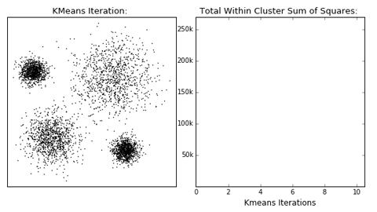
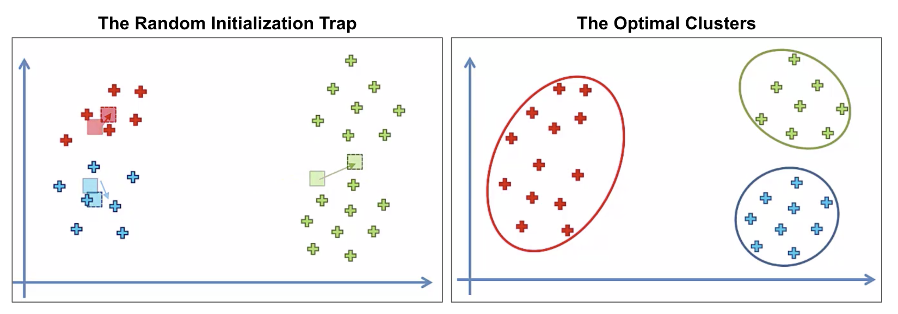
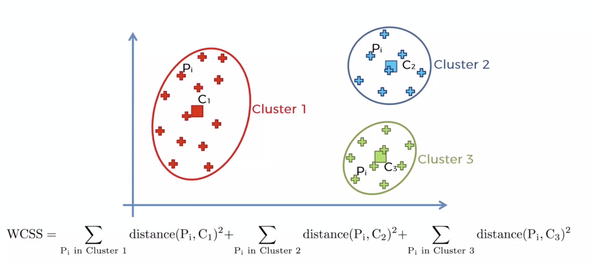
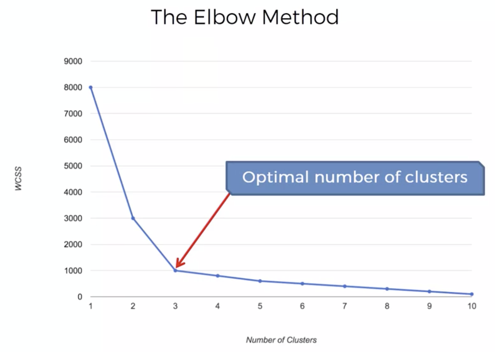

# K-means Clustering

## Intuition
Given a _number of clusters_, an _initialization point_ for each cluster centroid and a preferred _definition of distance_:
1. Assign each observation to the closest cluster by calculating the distance to the centroid 
using the given _definition of distance_.
2. Recalculate the centroid of each cluster averaging all the observations that belong to the cluster.
3. Repeat 1.  
   - If there are no re-assignments: stop.
   - If there are re-assignments: go to step 2.
 
 A gif is worth a million words:
 

### Hyper-parameters
1. Number of clusters.
2. Definition of distance: Manhattan, Euclidean, Minkowski, among many others.

### Pitfall: The Random Initialization Trap

In a _vanilla_ implementation of the k-means algorithm, __the result of the algorithm is dependent on the
initialization points for the centroids__. The following picture shows why:

#### How to combat this?
There is a variation of the algorithm called the [k-means++ algorithm](https://en.wikipedia.org/wiki/K-means%2B%2B)
which fixes this problem.

The course did not explain how it works. But, the good news is that most of the tools already implement this
variant so __we just need to make sure that we are using uses the _kmeans++_ variant__.  For example:
- R includes k-means, and the "flexclust" package can do k-means++
- Scikit-learn has a K-Means implementation that uses k-means++ by default.
- Weka contains k-means (with optional k-means++) and x-means clustering.
- Notably, at the time of this writing [Knime did not have the kmeans++ algorithm](https://forum.knime.com/t/accuracy-of-k-means-clustering/12721).

### Choosing the right number of clusters

To choose the right number of clusters we calculate and plot the _within cluster sum of squares (WCSS)_ metric across different
kmeans runs using different _number of clusters_.

We then use the use the plot to "eye-ball" the "elbow", which indicates us a good __candidate__ for the number of 
clusters.

_WCSS definition_

_The elbow method_

Here are some important things to consider:
- For some problems, the number of clusters (or an acceptable range) is given by the domain itself.
- WCSS is a function that always decreases. For example, if we have 50 points and 50 clusters the WCSS is 0. We don't 
strive to get the minimum WCSS, we want to balance the number clusters with the minimum WCSS.
- WCSS is called `inertia` in `sklearn`.
- The "elbow" method is an "eye-ball method". We can use it to get a starting point on the _number of clusters_, but
ultimately we need to plot the results of clustering with different number of Ks and make __a judgement call__ on what makes
sense for the given problem.

## Code
[Go here to see a full example.](/annotated-code/Part%204%20-%20Clustering/Section%2024%20-%20K-Means%20Clustering/kmeans.py)

Note that for visualization of high-dimensional problems, we can use dimensionality reduction techniques like
PCA or LDA to project the problem into 2 dimensions and then plot it.