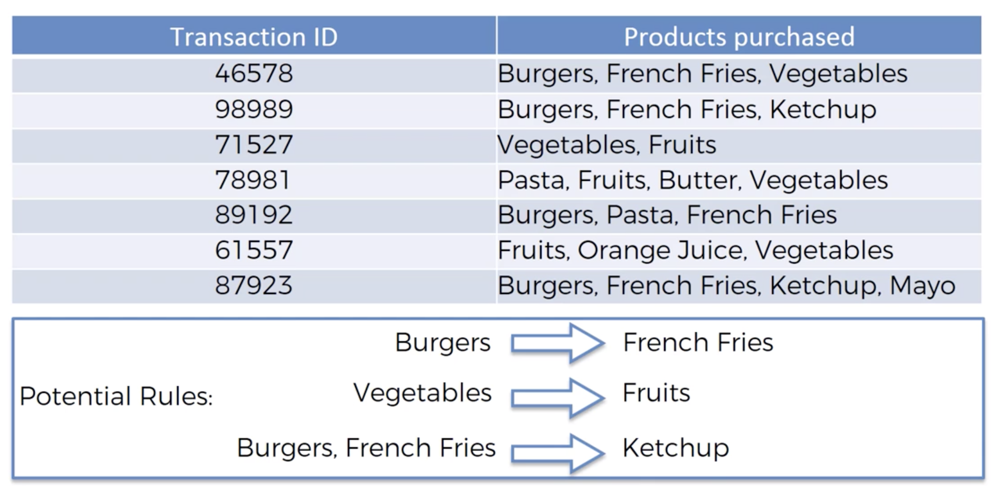

# Apriori

## Intuition
**In the rule `X -> Y`, `X` and `Y` represent itemsets.** For example `{Milk, Diaper} -> {Beer}`.
 
- People who bought X also bought Y
- People who watched X also watched Y
- People who did X also did Y

Here is the typical shape of the data: 

### Mathematical Components
#### Support

How likely it is to find a transaction that contains all items in the combined intemsets `XuY` (X union Y). 

`support(XuY) = P(XuY) = #_transactions_containing_items_in_X_and_Y / #_of_transactions`

Support is used in apriori to reduce the search space of the algorithm. e.g. For the rule `X -> Y` 
`support(XuY)` is used to compare against `min_support` (see Step 2 below).
 

#### Confidence

How likely it is for a person to buy `Y` given that he bought `X`.

`confidence(X -> Y) = = P(Y|X) = #_transactions_containing_items_in_XuY / #_of_transactions_containing_X`

#### Lift

How much more likely is it to find items in `X` and `Y` together (numerator), than by random chance (denominator).  

`lift(X -> Y) = P(X,Y) / [P(X) * P(Y)] = P(Y|X) / P(Y)`

- A `lift = 1` means that it is equally as likely to find `X` and `Y` together in a basked than by random chance.
- A `lift > 1` means that it is more likely to find `X` and `Y` together than by random chance.
  - There is some positive association between X and Y. e.g. `{Burger, Fries} -> {Soda}` 
- A `lift < 1` means that it is less likely to find `X` and `Y` together than by random chance.
  - There is some negate association between X and Y. e.g. if you are buying a fertility treatment, you are not buying condoms.
- Lift is a symmetrical function: `lift(X -> Y) = lift(Y -> X)`

### Steps

Among all the possible items we sell / movies we offer, we want to find the rules that have the highest (or lowest) lift
so that we can exploit that knowledge. 

In a naive implementation, `Apriori` would be very slow algorithm because in principle it would need to go through 
all the possible combinations of n-order rules. 
Luckily, the algorithm is smarter than that and is able o prune the search space if we give it a minimum support and confidence.

- Step 1: Set a minimum support, confidence, and lift. This will help the algorithm to prune the search space.
   - These parameters depend on your dataset and your business problem and are tuned **experimentally**. 
   Here are some guidelines:
   - `min_support`: 
     - We are interested only in rules that are backed by at least `n` amount of transactions, we can calculate
   a starting `min_support = n_we_want / total_transactions`.
   - `min_confidence`:
     - A very high `min_confidence` will lead to no rules or to very obvious rules.
- Step 2: Find the *Frequent Itemsets*. i.e. all the itemsets having `support > min_support`. 
  - e.g. If there are only a few transactions for `ItemRare`, then don't bother trying to find rules for it. 
- Step 3: For each *Frequent Itemset*, find all rules using subsets that have `confidence > min_confidence`.
  - Prune out rules that don't have strong signals.
- Step 4: Sort rules by decreasing **lift**.
  - The rule with the highest lift is the most interesting one.
  - We typically take the `top n` and act on them.
  - Note that sorting by **confidence** has an intrinsic problem: very high frequency items will always
  have high confidence, but that does not necessarily mean that the rule is interesting.
     - For example, assume that `Coffee` is present in 90% of the transactions.
     - Then a rule `Tea -> Coffee` will have a very high confidence because `#_transactions_containing_coffee_and_tea` 
     will be very close to `#_transactions_containing_tea` because coffee is in almost every transaction.
  
### Selecting the Data
The data that you would use as input needs to be selected with care to make sure that the data itself is not
biased. Bias could signal an association rule that is not there in reality. 

This extreme example illustrates the point: Lets say Peter is a very electric person that goes every hour to the supermarket and buys bread and batteries.
By the end of the year, the supermarket will have in its database thousands of transactions that contain bread and
batteries, but most of them will come from Peter.

If this data was not cleaned, the `apriori` algorithm will signal that there is a `Bread -> Batteries` rule. However,
this rule is not really generalizable because it was mostly influenced by Peter.

### Recommender Systems
`Apriori` is a simple way of creating a basic recommender system. However, world-class recommender systems
use much more complex models that may use `apriori` data as part of their features.
    

## Code
We are going to use this implementation of the `apriori` algorithm: https://github.com/ymoch/apyori
The implementation is also available through `pip`.

Apyori has the following caveats:
- The data is returned in a very messy data structure
- The rules are not sorted in any order by default, it is up to us to sort them by lift.

[Go here to see a full example.](/annotated-code/Part%205%20-%20Association%20Rule%20Learning/Section%2028%20-%20Apriori/apriori_analysis.py)
